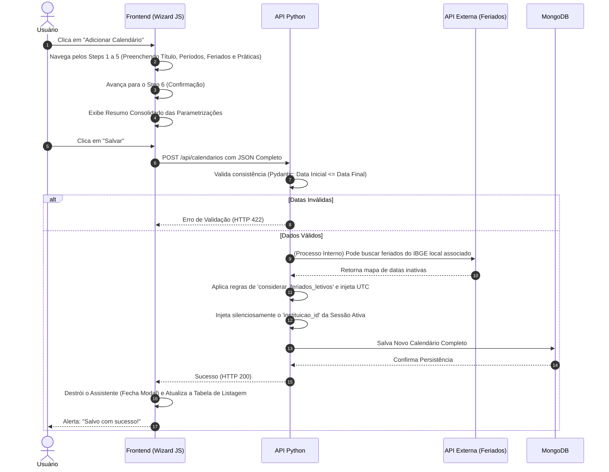

# Análise de Regras de Negócio: Módulo de Gestão de Calendários

## 1. Contexto Geral
O ecossistema do **Calendário Acadêmico** do SENAI atua em duas frentes distintas, mas interligadas:
1. **Gestão de Calendários (Individual):** Responsável pela parametrização da "régua" letiva de uma unidade. Permite configurar os períodos, quais dias da semana contemplam ensino Presencial ou EAD, gerenciar dias de prática e lidar com os dias de recessos/feriados. O fluxo de criação segue um assistente passo a passo (*Wizard*).
2. **Calendário Geral (Visão Global):** Um painel gerencial (usando *FullCalendar*) que consolida os eventos de diferentes calendários cadastrados. Ele permite criar "Eventos Cruzados" (ex: reuniões pedagógicas ou feriados extraordinários) que refletem simultaneamente em vários calendários de uma só vez.

---

## 2. Regras de Isolamento e Segurança (Multi-tenant)
* **Isolamento de Visibilidade (`GET`):** Tanto a listagem de calendários quanto o espelhamento de eventos no painel global filtram rigorosamente os dados baseados no `instituicao_id` associado ao Token da sessão do usuário (`ctx.inst_oid`). Nenhuma instituição enxerga calendários de outra.
* **Proteção de Escrita Automática:** Em qualquer processo de persistência (Criação de Calendário ou Evento), o Backend ignora eventuais identificadores de instituição enviados no JSON do Frontend e **força a injeção do ID da Instituição extraído diretamente do Token** JWT de quem realizou a requisição.
* **Trilha de Auditoria Compulsória:** A API Python injeta as variáveis sistêmicas `data_criacao`, `alterado_em` e `alterado_por` (ID do usuário ativo) no formato de fuso horário UTC na inserção ou alteração de registros.

---

## 3. Dicionário de Dados e Validações

### 3.1. Validações do Objeto Calendário
A API Python (através do pacote Pydantic) e o Frontend possuem travas sobre a criação de um calendário:

| Campo | Regra de Negócio |
| :--- | :--- |
| `titulo` | **Obrigatório.** Limite entre **3 e 150 caracteres**. O Frontend converte automaticamente para **MAIÚSCULAS**. |
| `inicio_calendario` e `final_calendario` | **Obrigatórios.** A API possui um `model_validator` estrito: a data final **jamais** pode anteceder a data inicial. Se enviado, a requisição é negada. |
| `status` | **Obrigatório.** Os únicos estados aceitos são **Ativo** ou **Inativo**. Na criação de um novo calendário, o status nasce compulsoriamente como "Ativo". |
| Modalidades (`is_presencial_off` / `is_ead_off`) | O sistema trata modalidades de ensino como "interruptores" booleanos (Switches em tela). |
| Grades Semanais (`dias_presenciais` / `dias_ead`) | Array contendo os dias úteis letivos escolhidos para a referida modalidade (ex: `["Segunda", "Terça", "Quarta"]`). |

### 3.2. Integração com Base de Feriados Nacionais
* A configuração pedagógica permite consultar automaticamente uma API pública de feriados (`feriadosapi.com`) utilizando o Ano, UF e IBGE associados para injetar dias inativos na trilha letiva.
* **Regra de Decisão do Feriado:** O preenchimento da variável `considerar_feriados_letivos` dita como o sistema calcula as horas. O usuário define ativamente se um feriado externo deve ser computado como **Dias Letivos Normais** (ignora o feriado) ou se será transformado em **Recesso Automático** (suspende aulas no dia).

---

## 4. Fluxos Principais de Ação

### 4.1. Fluxo de Criação (Wizard Progressivo)
Para blindar o usuário de erros, a criação não é um simples formulário vertical, mas sim um passo a passo condicional de 6 etapas:
1. **Geral:** Definição do Título e dos Limites de Data (Início/Fim).
2. **Presencial:** Ativação/desativação e escolha dos dias letivos na semana da modalidade presencial.
3. **EAD:** Ativação/desativação e escolha dos dias letivos EAD.
4. **Feriados:** Escolha da regra de letividade dos feriados, além de permitir o cadastro pontual de recessos avulsos.
5. **Prática:** Injeção de datas extras específicas que ocorrerão como Aula Prática na Unidade. Requer obrigatoriamente data + texto de descrição.
6. **Confirmação:** A última etapa do *Wizard* consolida os 5 passos anteriores, exibe um "Resumo" da parametrização em tela e, somente ao confirmar, dispara a gravação (`POST`) ao Backend.

### 4.2. Edição de Dados e Escudo Temporal
Na interface de edição das propriedades do calendário:
* O sistema permite livre alteração do **Título** e o trânsito do status entre **Ativo / Inativo**.
* **Trava Histórica:** Os campos de "Início" e "Fim" do Calendário tornam-se ineditáveis (`readonly disabled`). Uma vez que um período-base foi estabelecido (e possivelmente atrelado a turmas), sua raiz temporal não pode sofrer mutação pelo formulário básico.

### 4.3. Regra de Retenção de Histórico (Proibição de Deleção)
Assim como no módulo de Instrutores, os calendários não admitem o *Hard Delete* para manter a coesão histórica das turmas. 
* Ao tentar excluir, o clique é interceptado.
* O sistema exibe a mensagem: *"O calendário não pode ser excluído definitivamente. Para removê-lo das listagens, altere seu status para 'Inativo' na edição."*

### 4.4. Eventos Cruzados (Calendário Geral)
Se um coordenador precisar adicionar um evento genérico (ex: Capacitação de Docentes) através da Visão Global em *vários calendários*:
* **Regra de Interseção de Datas:** O script (`computeSelectedCalendarsRange`) avalia todos os calendários selecionados. O novo evento **só poderá ocorrer** no intervalo de datas que seja simultaneamente válido para **todos** os calendários escolhidos. As datas do *input* de início e fim do evento têm seu `min` e `max` recalculados em tempo real na interface, impedindo agendamentos ilegais.

---

## 5. Diagrama do Fluxo de Criação (Wizard)

