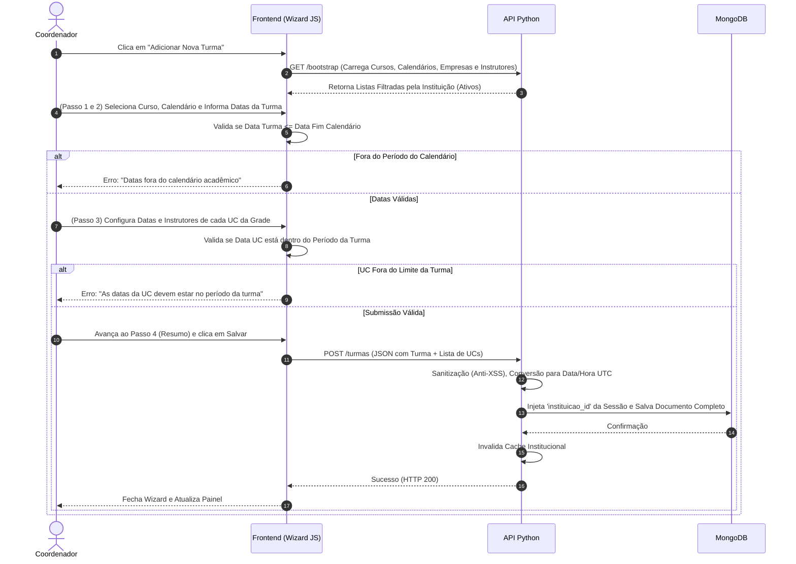

# Análise de Regras de Negócio: Módulo de Gestão de Turmas

## 1. Contexto Geral
O módulo de **Gestão de Turmas** é o ponto de convergência acadêmica do sistema, onde as entidades Curso, Calendário Acadêmico, Empresa e Instrutores se encontram. Ele permite criar uma turma, atrelá-la a um calendário letivo específico e definir o cronograma de aulas de cada disciplina (Unidade Curricular - UC), incluindo a alocação dos instrutores que irão ministrá-las.

O módulo utiliza um modelo de preenchimento progressivo em etapas (Wizard) no Frontend para guiar o coordenador pedagógico, evitando erros de estruturação da grade curricular.

---

## 2. Atores e Isolamento (Multi-tenant)
A regra de segurança garante o isolamento institucional total:
* **Isolamento de Visibilidade:** Apenas turmas atreladas à `instituicao_id` do usuário logado são exibidas.
* **Isolamento de Escrita e Validação:** Durante a criação, edição ou deleção, o Backend Python injeta compulsoriamente a `instituicao_id` extraída do Token JWT, ignorando qualquer informação enviada pelo Frontend. O sistema também garante que os cadastros de apoio listados (Cursos, Calendários, Empresas e Instrutores) pertençam exclusivamente à instituição do usuário e estejam com o status **"Ativo"**.
* **Invalidação de Cache:** Qualquer alteração no banco de turmas aciona o `invalidate_cache`, forçando a atualização do sistema para a unidade de ensino.

---

## 3. Dicionário de Dados e Validações Globais (Backend)
O modelo `TurmaModel` e seus sub-modelos (`TurmaUcModel`) blindam a inserção de dados aplicando regras rígidas e sanitização (`FORBIDDEN_CHARS`). Caracteres como `< > " ' ; { }` são bloqueados na entrada de dados via API.

| Campo (Turma) | Regras e Validações de Negócio |
| :--- | :--- |
| `codigo` | Obrigatório. Representa a identificação única visual da turma (Ex: HT-DES-01). Deve conter entre 3 e 50 caracteres. O Frontend converte automaticamente para MAIÚSCULAS. |
| `curso_id` | Obrigatório. Vínculo com o Curso. O Backend busca a grade curricular parametrizada deste curso para criar o esqueleto da turma. |
| `calendario_id` | Obrigatório. O calendário letivo base (que define os limites de feriados e dias de prática). |
| `empresa_id` | Obrigatório. Empresa parceira vinculada ou cadastro de "Venda Direta" para alunos avulsos. |
| `turno` | Obrigatório. Restrito a: **Manhã**, **Tarde**, **Noite** ou **Integral**. |
| `qtd_alunos` | Obrigatório. Deve ser um número inteiro maior ou igual a 1. |
| `data_inicio` / `data_fim` | Obrigatórias. A API exige que os dados sejam convertidos para o fuso horário `UTC`. O Frontend valida se a `data_fim` é maior ou igual à `data_inicio`. |
| `situacao` | Obrigatório. Define o momento de vida da turma. Opções: **Não iniciada**, **Em andamento**, **Concluída**, **Cancelada**. |
| `status` | Obrigatório. **Ativo** ou **Inativo**. |

---

## 4. Regras de Negócio e Fluxos de Criação (Wizard)

O preenchimento da turma ocorre em 4 Etapas Obrigatórias (Wizard).

### 4.1. Passo 1: Identificação
1. O usuário preenche o Código, seleciona o Curso e o Calendário.
2. Ao selecionar o Curso, o Frontend exibe, de forma descritiva e não editável (Read-Only), as configurações de apoio (`modalidade`, `area_tecnologica`, `tipo_curso` e `carga_total_curso`).
3. O Backend injeta, via Rota de Bootstrap, o nome das UCs dentro da estrutura do curso escolhido (resolvendo a referência). Se o curso não possuir UCs parametrizadas (carga horária distribuída), a interface exibe um alerta de bloqueio: *"Este curso não possui UCs cadastradas na parametrização"*.

### 4.2. Passo 2: Operação (Validação de Datas do Calendário)
A principal regra de temporalidade é avaliada neste passo:
1. As datas globais da Turma (`dataInicio` e `dataFim`) **devem estar obrigatoriamente contidas dentro do período definido pelo Calendário Acadêmico selecionado no Passo 1**.
2. O Frontend aplica limites mínimos e máximos (`min` e `max`) nos campos de data e dispara um alerta impeditivo se a regra for violada: *"As datas da turma devem estar dentro do período do Calendário Acadêmico: De [Data Inicial] a [Data Final]"*.

### 4.3. Passo 3: Grade de UCs e Alocação de Docentes
Esta é a camada mais complexa de regra de negócio, responsável por detalhar *quando* cada disciplina ocorre e *quem* vai lecioná-la.

1. **Obrigatoriedade de Preeenchimento:** Para cada Unidade Curricular (UC) listada no curso, o coordenador é obrigado a definir a `data_inicio`, `data_fim` e designar o `Instrutor Titular`.
2. **Validação de Limites da Grade:**
    * Nenhuma UC pode iniciar antes ou terminar depois das datas globais estipuladas para a Turma no Passo 2.
    * Se violado, a interface bloqueia e alerta: *"As datas da UC 'X' devem estar dentro do período da turma"*.
3. **Substituição Docente (Exceção Temporária):** O sistema possui uma regra para lidar com afastamentos. Existe uma opção (Checkbox) "Possui Substituto Temporário?". Se ativada, o coordenador deve informar o `Instrutor Substituto` e o período exato (Início e Fim) em que ele assumirá a disciplina no lugar do titular.

### 4.4. Edição e Proteção do Histórico
Durante a atualização de uma turma (`PUT`), o sistema aplica um "escudo" aos metadados de auditoria. O middleware PHP e a API Python garantem a remoção do campo `data_criacao` (`criado_em`) do pacote modificado, preservando o momento exato em que a turma foi originalmente gerada.

---

## 5. Diagrama de Fluxo (Criação de Turma e Validação de Calendário)

